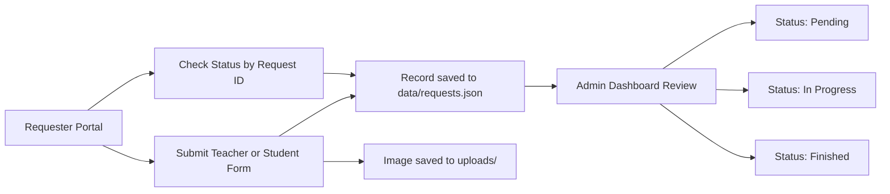

# ID Request Management System

A lightweight, professional web application for handling school ID requests with separate requester and admin experiences.

This system supports both Teacher and Student request flows, local JSON storage (no database), image uploads, request status tracking, and an admin review dashboard.

## Overview

- Requester Portal: submit Teacher or Student ID requests and check request status by Request ID.
- Admin Dashboard: review submitted records, view full request details, update workflow status, and delete records.
- Storage: local JSON file plus local uploads directory.

## Current Workflow



## Key Features

### Requester Side

- Sidebar navigation:
   - Teacher Request
   - Student Request
   - Check Status
- Teacher form:
   - Name
   - Employee Number
   - BIR TIN (optional, auto format)
   - SSS No (optional, auto format)
   - Philhealth No (optional, auto format)
   - Pag-ibig No (optional, auto format)
   - E-signature (PNG/JPG, required)
   - Guardian Name
   - Guardian Address
   - Contact Number
- Student form:
   - Name
   - LRN
   - Student Number
   - Birthday
   - Parent/Guardian Name 1
   - Parent/Guardian Name 2 (optional)
   - Parents Address
   - Contact Number 1
   - Contact Number 2 (optional)
   - Student Picture (PNG/JPG, optional)
- Success modal after submission with Request ID display.
- Status checker by Request ID.

### Admin Side

- Professional, read-only review panel (no record editing).
- Summary cards:
   - Total Requests
   - Pending
   - In Progress
   - Finished
   - Students
- Request table with Type, details preview, image link, and actions.
- Full details panel per selected request.
- Status control:
   - Pending
   - In Progress
   - Finished
- Delete request support with file cleanup.

## Tech Stack

- Node.js
- Express
- Multer (image upload handling)
- Vanilla HTML/CSS/JavaScript
- JSON file persistence

## Project Structure

```text
ID-system/
   data/
      requests.json
   public/
      admin.html
      admin.js
      teacher.html
      teacher.js
      styles.css
   uploads/
   server.js
   package.json
```

## Getting Started

### 1. Install dependencies

```bash
npm install
```

### 2. Start the server

```bash
npm start
```

### 3. Open in browser

- Requester Portal: http://localhost:3000/
- Admin Dashboard: http://localhost:3000/admin

## API Endpoints

- `GET /api/requests`
   - Returns all requests sorted by newest first.
- `POST /api/requests`
   - Creates teacher or student request.
- `PATCH /api/requests/:id`
   - Updates request status (`pending`, `inprogress`, `finished`).
- `DELETE /api/requests/:id`
   - Deletes request and linked uploaded files.
- `GET /api/requests/:id/status`
   - Public request status lookup by Request ID.

## Data and File Handling

- Request records are stored in `data/requests.json`.
- Uploaded images are stored in `uploads/`.
- Automatic cleanup includes:
   - Removing uploaded files when submission validation fails.
   - Removing linked files when a request is deleted.
   - Startup orphan-file cleanup to keep `uploads/` in sync with JSON data.

## Notes

- This project is intended for local or internal network use.
- There is currently no authentication/authorization layer.
- For production deployment, add security hardening (auth, rate limiting, input audit, backup strategy).

## License

ISC
